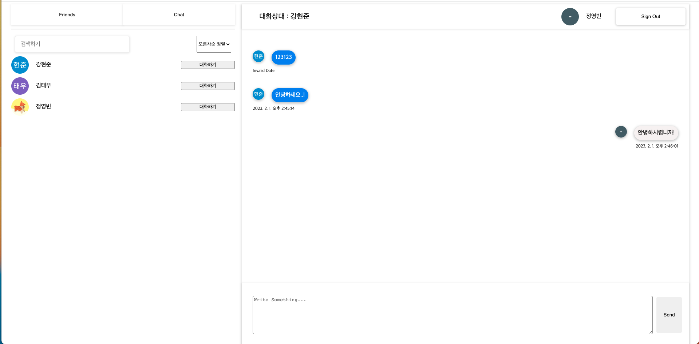
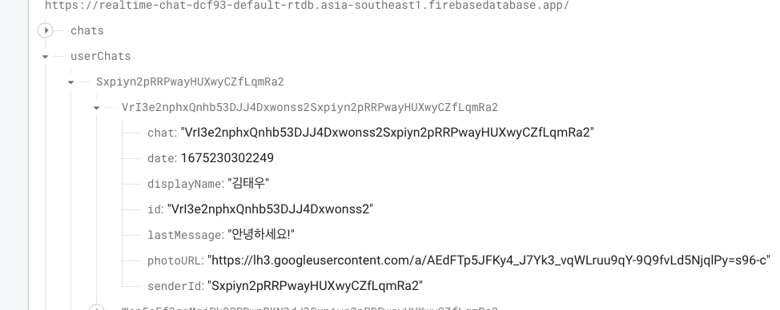
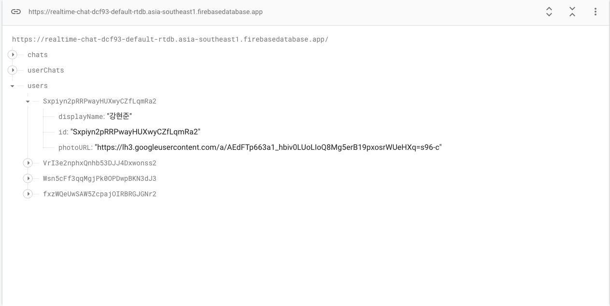

# 🖥️ REALTIME CHAT WEB APP



<code>#Firebase Realtime Database v9</code>
<code>#Redux</code>
<code>#React</code>

React를 기반으로 Firebase의 RealTime Database에 올린 데이터를
Redux를 통해 받아서 보여주는 실시간 채팅 웹 어플리케이션 입니다.

- 기간: 2023.01.30 - 2023. 02. 01

👉 Deploy Address: https://63da216fac75a45f6c061b16--sweet-cannoli-4b6422.netlify.app/

## Installation

```sh
npm install
```

## Development

```sh
npm start
// localhost:3000
```

## TODO

- [x] 친구 목록 페이지, 채팅 목록 페이지, 채팅 페이지가 있습니다.
- [x] 친구 목록 페이지에는 채팅 목록으로 이동할 수 있는 버튼이 있어야 합니다.
- [x] 친구 목록 페이지에는 친구 이름, 사진과 함께 채팅을 시작할 수 있는 버튼이 있어야 합니다.
- [x] 친구 목록 페이지에 있는 “대화하기” 버튼을 이용해 해당 친구와의 채팅 페이지로 바로 이동할 수 있습니다.
- [x] 친구 목록은 이름을 기준으로 오름차순 또는 내림차순 정렬할 수 있는 기능이 있어야 합니다.
- [x] 친구 목록에 있는 검색창을 이용해 친구 이름을 기준으로 검색할 수 있는 기능이 있어야 합니다.
- [x] 채팅 목록에는 진행 중인 채팅이 날짜 순으로 나열되어야 합니다. (최신날짜가 상위)
- [x] 채팅 목록 페이지에는 친구 목록으로 이동할 수 있는 버튼이 있어야 합니다.
- [x] 채팅 목록에는 진행 중인 채팅의 친구 이름, 가장 최신 메시지의 첫 20글자, 가장 최신 메시지 전송 날짜가 표기되어야 합니다.
- [x] 채팅 목록에서 채팅을 선택하면 채팅 페이지로 이동합니다.
- [x] 채팅 페이지에는 상대방과 나눈 대화가 시간 순(최근 메시지가 하위)으로 나열되어야 합니다. 상대방 이름, 메시지 내용, 전송 날짜 및 시간이 모두 표기되어야 합니다.
- [x] 채팅 페이지는 별도 URL이 필요하지 않습니다.
- [x] 채팅 페이지에서 메시지를 전송할 경우, 현재 채팅 페이지와 채팅 목록 페이지에 새로운 메시지가 반영되어야 합니다.
- [x] Firebase Realtime Database를 이용하여 실시간 채팅 기능이 구현되어야 합니다.
- [x] 페이지 새로고침에 대한 대응은 하지 않아도 괜찮습니다.

<br>

## 🖼 Step:
### 홈
  - 구글 로그인 한 후 화면이 늦게 로딩 됩니다.
  - Home을 기준으로 친구 목록 페이지, 채팅 목록 페이지, 채팅 페이지가 전부 보이게 개발하였습니다.
  - Home Component가 처음 마운트 될 때
  - 로그인한 유저의 정보를 업데이트 하여 Firebase의 Realtime database 에 올려놓습니다.
  - 그리고 나서 Firebase의 Realtime Database에 올라가 있는 채팅목록,유저,채팅 메세지들을 받아오게 하였습니다.
  ```
  line:33 dispatch(getUsersChats)
  line:33 dispatch(getUsers)
  line:33 dispatch(getChatMessages)
  ```
  <br>

### 친구 목록
  - Sidebar에 친구 목록과 채팅 목록을 보이게 하는 컴포넌트를 클릭한 버튼에 따라서 보이게 만들었습니다.
  - 초기 값은 친구 목록으로 설정되어 있어 FriendsLists Component의 대화하기 버튼을 실행하면 해당하는 유저만의 채팅 기록을 불러오게 하였습니다.
  - FriendsLists Component의 startChats startChats의 useCallback이 실행되어 이 유저가 선택한 유저와 채팅한 기록이 없다면 <code>`userChats/${selectedUserName}`</code> 에 Selected User와 Current User를 조합한 Id로 새로운 key값과 데이터들을 작성합니다.
<br>

### 채팅박스
  - ChatBox 컴포넌트로 넘어가서 채팅을 입력하고 Send 버튼을 누르면 입력된 값이 없다면 alert를 띄우고 있다면 기존의 userChats의 입력한 사람과 받은 사람의 채팅메세지 목록주소에 update를 합니다. 각각에 가장 최근의 메세지와 최근의 날짜를 입력해주고 모든 메세지의 id는 uuid를 통해 새로운 id를 받아옵니다.
  - update이후 database의 userChats 키값에 접근해 getUserChats 액션을 통해 값을 한번 더 가져와 리덕스를 통해 채팅 목록을 업데이트 합니다. .
  - 이와 동시에 Firebase Realtime database의 onValue속성을 통해 Home Component의 <code>getChatMessages</code>가 실행되어 리덕스로 보내고 리덕스에서 최신 상태를 업데이트 합니다.
<br>

### 채팅 목록
  - 위의 채팅 목록을 누르면 mode가 바뀌고 친구목록은 안보이게 됩니다.
  - 가장 최근의 메세지를 받은 순서대로 최신화가 되어 상단에 위치합니다.
  - 원하는 유저를 선택하면 하위 컴포넌트인 <code>Profile</code>에서 updateSelectedUser action을 보내어 대화 상대가 바뀌고 그 사람에게 메세지를 보낼 수 있게 됩니다.
  - Profile 컴포넌트는 채팅 목록의 날짜로 최신화 하기 위해 따로 분리하였습니다.
<br>

### layout
  - layout폴더에는 Header, sideHeader, searchInput, messages가 있습니다.
  - 검색 같은 경우는 includes를 사용하여 keyword의 상태를 useState로 관리하여 각 displayName이 포함한다면 보여주게 하였습니다.

<br>

### Data Structure
  - 데이터 구조의 경우 채팅 목록, 유저, 채팅 메세지들로 구성하였습니다.
  - /userChats
  - 각 채팅 목록에는 개인 마다의 방이 있고 그 안에 자기가 대화를 나눈 사람과의 고유 id가 합쳐져 sort가 된 고유 id를 하위로 생성하여 데이터들을 넣어 사용하게 하였습니다.

  

  - /users
  - 유저같은 경우 각각의 로그인 했던 기록이 있는 유저들의 정보만 기록하였습니다.

  

  - /chats
  - 채팅 메세지들 같은 경우는 결합된 id를 하나의 key로 사용하여 uuid로 만든 고유의 메세지를 두명이서 같이 추가하게 하였습니다.
<br>
## 서술형 문답

### 질문 목록

- 리액트를 사용하는 이유는 무엇인가요?
- 리덕스를 사용하는 이유는 무엇인가요?
- 가상돔이란 무엇이며, 리액트는 가상돔을 어떻게 이용하나요?
- 상태 불변성이란 무엇인가요?
- 리액트에서 리스트를 렌더링할 때, <code>key</code>라는 prop을 넣어주는 이유는 무엇인가요?
- 리액트 훅의 장점과 단점은 무엇인가요?
- 주소창에 url을 입력했을 때, 페이지가 렌더링 되기까지의 과정은 어떻게 되나요?


### 리액트를 사용하는 이유는 무엇인가요?

- 리액트의 등장 이전에도 jQuery나 Angular와 같은 라이브러리/프레임워크들이 존재했는데 시간이 흐르며 Web App의 크기가 커지며
jQuery로는 효율적으로 관리하기가 어려워져서 조직적인 데이터 관리가 중요해짐이 화두가 됨과 동시에 HTMl CSS JS에서 JS의 중요성이 증대하였고,
- SPA가 등장하게 되면서 이러한 것을 해결할 수 있는 요소로 React등이 성장하게 되었습니다.
- 선언적 API를 제공하여 매번 무엇이 바뀌는 지를 걱정할 필요가 없고 React의 비교 알고리즘인 휴리스틱 알고리즘을 통해 빠르게 바뀐 UI만 업데이트 시켜
렌더링에 있어서 비효율 적인 것들을 줄이고 빠르게 해줍니다.
- 이를 해주기 위한 Virtual DOM을 중간 공간에 두어 상태 변경을 효율적으로 관리해줄 수 있고,
- 컴포넌트 단위의 개발을 하게 됨으로써 재사용과 가독성이 좋아집니다.
- 또한 JSX를 지원함으로서 JS의 확장성을 통해 다양한 표현이 가능해집니다.
- 이처럼 유연하고 빠르게 렌더링을 시킬 수 있는 라이브러리여서 사용한다고 할 수 있습니다.

### 리덕스를 사용하는 이유는 무엇인가요?

- 기존의 React만 사용하는 경우 데이터 규모가 커짐에 따라 props drilling방식으로 상태 관리에 있어 debugging에 애를 먹는 경우가 많이 생기고
- 컴포넌트들이 서로가 서로에게 의존성이 생기게 되면서 재사용을 어렵게 만들기도 합니다.
- 그리고 기존의 데이터를 바꾸는 것이 아닌 새로운 데이터를 생성할 수 있는 상태 불변성을 제공하기 때문에 업데이트에 적합합니다.
- 또한 리듀서가 순수 함수로써 항상 일정한 값을 예측할 수 있어 사용합니다.

### 가상돔이란 무엇이며, 리액트는 가상돔을 어떻게 이용하나요?

- Virtual DOM 이란 DOM을 추상화한 가상의 객체로써 웹사이트가 렌더링 되기 이전에 가상 돔에 안착을 시키고 현재 웹사이트와의 비교를 통해 
다른 부분만 업데이트 할 수 있는 중간다리 역할을 한다고 볼 수 있다.
- 기존의 DOM과 Virtual DOM을 비교할 때 비교 알고리즘이 사용이 되어 빠르고 효율적이게 렌더링이 가능합니다.
### 상태 불변성이란 무엇인가요?

- Javascript에서는 객체들은 참조값을 사용하기 때문에 가변적이다. 이에 리액트에서는 참조값이 동일하면 변경을 감지할 수 없습니다.
- 리액트가 상태값을 업데이트 할 때 얕은 비교를 사용하기 때문에 배열이나 객체를 새로운 참조값을 지닌 것으로 생성하여 상태변화를 감지하게 만듭니다. 
- 또한 원본데이터를 사용하고 있다면 어디에선가 사이드 이펙트가 일어날 수 있기 때문에 이것을 방지하고자 하는 이유도 있습니다. 
### 리액트에서 리스트를 렌더링할 때, <code>key</code>라는 prop을 넣어주는 이유는 무엇인가요?

- 리액트에서는 어떤 항목을 변경, 추가 또는 삭제할 때 key를 이용하여 식별합니다. 
- DOM 노드의 자식들을 재귀적으로 처리할 때 두 리스트를 순회하고 차이점이 있으면 변경을 생성합니다. 예를 들어 자식의 끝에 추가한다면 잘 작동할 것입니다.
- 하지만 순서가 바뀔 경우 자식들 까지 다같이 바꾸는 경우가 생기게 될 수 있습니다. 이를 방지하기 위해 기존의 key값과 비교하여 생성하게 됩니다.
- 또한 index를 key로 사용하면 컴포넌트의 state와 관련된 문제가 발생할 수 있기 때문에 (의도하지 않은 방식으로) 고유한 값을 만드는 것이 좋습니다.

### 리액트 훅의 장점과 단점은 무엇인가요?

- 리액트가 기존에 class로 사용하던 경우 컴포넌트 사이에서 상태 로직을 재사용하기가 어려웠고, 복잡한 컴포넌트들은 이해하기가 어려웠습니다.
- 이에 기존의 알고 있는 class의 개념을 대체하지 않으면서 좀 더 직관적이고 간결하게 코드를 짜는 것이 필요했고 이것이 함수형 컴포넌트에서 훅을 사용함으로써 가능해졌습니다.
- 장점으로는 위의 것들을 포함하여, 상태를 재사용하기가 용이하고 메모리 자원을 덜 소비하고 하나의 코드를 짜기위해 불필요한 수많은 코드들을 제거할 수 있습니다.
- 또한 Custom Hook을 사용할 수 있어 개발의 확장성을 늘려줍니다.
- 단점으로는 호출되는 순서에 의존한 다는 것입니다. 반복문 혹은 조건문 중첩된 함수 내에서 호출할 수 없이 항상 컴포넌트의 바로 하단 최상단에서만 사용해야 한다는 것이 단점입니다.
- 클로져에 의존적이어서 데이터가 늘어나면 이해하기가 어려워질 수 있습니다.

### 주소창에 url을 입력했을 때, 페이지가 렌더링 되기까지의 과정은 어떻게 되나요?

- 클라이언트에서 url이 입력되면 DNS를 통해 IP주소로 변환되게 됩니다. 이는 메모리적인 측면에서 text보다 IP로 변환하게 되면 가져오는 효율적 측면이 높기 때문입니다.
- TCP / IP 통신을 통해 서버에 request 요청을 보냅니다.
- request를 토크나이징 한 후 html파일을 요청하고 서버 컴퓨터로부터 응답을 받아 HTTP를 통해서 파싱된 html 파일과 css등의 정보를 제공받습니다. (DOM TREE)
- 이 때 CSS는 스타일 트리가 되어 DOM TREE와 STYLE TREE를 하나의 RENDER TREE로 묶습니다.
- 그리고 나서 레이아웃 단계를 가져 화면에 어느 위치에 무엇이 그려질지를 표시합니다.
- 레이아웃을 기반으로한 화면에 표시해주고 그려주는 페인트 작업을 실행합니다.
- 레이아웃이 한번 실행된 뒤의 다시한번 더 렌더링이 필요할 때에는 리플로우 작업이 실행됩니다.
- 마찬가지로 리페인트 작업이 실행되면서 렌더를 끝마칩니다.
